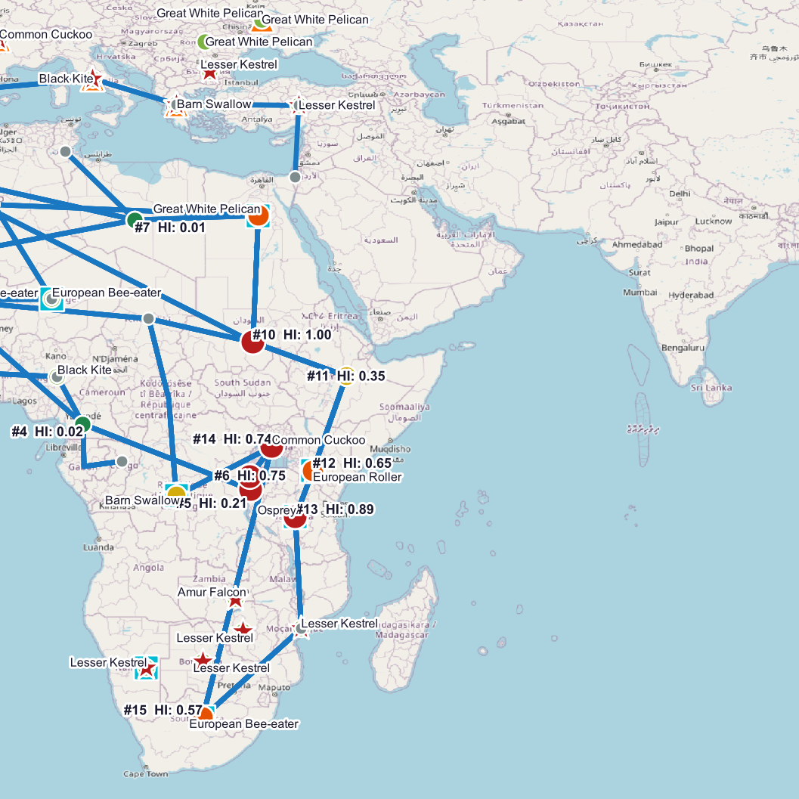
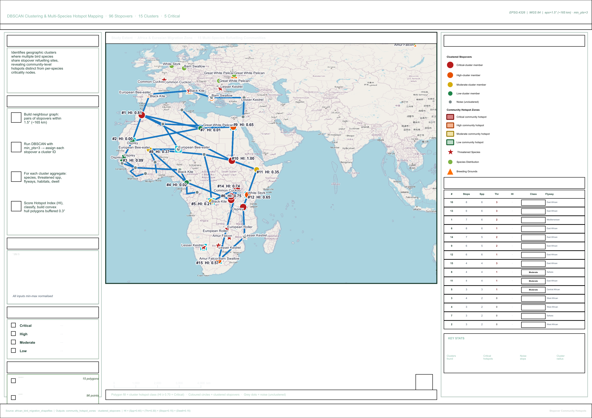

# African Bird Migration — Stopover Community Hotspots

> **A density-based clustering analysis** that groups the 96 stopover sites into
> spatially-coherent multi-species refuelling communities using DBSCAN, then
> scores each community by species richness, threatened-species presence,
> stopover density, and total dwell load to identify the most ecologically
> important multi-species hotspot zones.

---

## Table of Contents

1. [Project Overview](#project-overview)
2. [How This Differs from the Other Analyses](#how-this-differs)
3. [Folder Structure](#folder-structure)
4. [Input Layers](#input-layers)
5. [Output Layers](#output-layers)
6. [Methodology — Step-by-Step](#methodology)
7. [DBSCAN Parameters & Hotspot Index Formula](#formulas)
8. [Classification Thresholds](#classification-thresholds)
9. [Results](#results)
10. [Layer Symbology](#layer-symbology)
11. [Project Configuration](#project-configuration)
12. [Reference Map](#reference-map)
13. [How to Reproduce](#how-to-reproduce)
14. [File Inventory](#file-inventory)

---

## Project Overview

| Property | Value |
|---|---|
| **Project title** | African Bird Migration — Stopover Community Hotspots |
| **Project file** | `African_Bird_Stopover_Community_Hotspots.qgz` |
| **CRS** | EPSG:4326 — WGS 84 |
| **Spatial extent** | -22°W to 115°E, -38°S to 66°N |
| **Stopover sites clustered** | 96 (76 in clusters · 20 noise) |
| **Clusters identified** | 15 |
| **Critical hotspots** | 5 |
| **DBSCAN parameters** | eps = 1.5° (~165 km) · min_pts = 3 |
| **Hull buffer** | 0.3° outward inflation |
| **QGIS version** | 3.40.14-Bratislava |

The central question this analysis answers:

> **Where do multiple bird species converge to share refuelling sites,
> creating multi-species community hotspots that warrant region-level
> conservation attention?**

This is a complementary inversion of the Criticality Network analysis.
That analysis found exclusively-dependent bottleneck nodes (sites that
matter to one specific species). This one finds shared community zones
(sites that matter to many species at once) — and the two together
give a complete picture of conservation priorities at different levels.

---

## How This Differs

| Aspect | Criticality Network | **Community Hotspots** |
|---|---|---|
| **Detection logic** | Exclusive dependency (no alternative within 500 km) | **Spatial co-occurrence (DBSCAN density)** |
| **Question** | Which sites strand a species if lost? | **Where do species converge?** |
| **Output unit** | Individual stopover points | **Polygon community zones** |
| **Risk dimension** | Network fragility | **Multi-species richness** |
| **Conservation use** | Site-by-site protection | **Region-level zone designation** |

All five analyses (Vulnerability, Criticality, Habitat Dependency, Weighted Pair,
Community Hotspots) use the same six input datasets and answer different
conservation questions.

---

## Folder Structure

```
African_Bird_Stopover_Community_Hotspots/
│
├── African_Bird_Stopover_Community_Hotspots.qgz   (70.2 KB)
│   └── 7 layers, symbology, labels, draw order, layout
│
├── README.md
│
├── Input_layers/
│   ├── migration_routes.gpkg               (104.0 KB  |  27 features)
│   ├── stopover_sites.gpkg                 (116.0 KB  |  96 features)
│   ├── species_distribution.gpkg           (112.0 KB  |  94 features)
│   ├── threatened_species_priority.gpkg    ( 96.0 KB  |  30 features)
│   ├── breeding_grounds.gpkg               ( 96.0 KB  |  10 features)
│   └── wintering_grounds.gpkg              ( 96.0 KB  |  10 features)
│
└── Output_layer/
    ├── community_hotspot_zones.gpkg        (112.0 KB  |  15 polygons)
    ├── clustered_stopovers.gpkg            (116.0 KB  |  96 points)
    └── reference_layout.png                ( 1.80 MB  |  200 dpi, A3)
```

---

## Input Layers

All six layers are in **EPSG:4326 (WGS 84)** stored as GeoPackages in `Input_layers/`.
The `stopover_sites` layer is the primary input.

| Layer | File | Geometry | Features | Used For |
|---|---|---|---|---|
| Stopover Sites | `stopover_sites.gpkg` | Point | 96 | Clustering input — `species`, `habitat`, `flyway`, `duration_d` |
| Threatened Species | `threatened_species_priority.gpkg` | Point | 30 | Threatened-status flag |
| Migration Routes | `migration_routes.gpkg` | LineString | 27 | Map context |
| Species Distribution | `species_distribution.gpkg` | Point | 94 | Map context |
| Breeding Grounds | `breeding_grounds.gpkg` | Point | 10 | Map context |
| Wintering Grounds | `wintering_grounds.gpkg` | Point | 10 | Map context |

---

## Output Layers

### 1. `community_hotspot_zones.gpkg` — 15 features (Polygon)

Convex-hull polygons (buffered by 0.3°) representing each DBSCAN cluster as
a community refuelling zone, with full aggregate metrics attached.

| Field | Type | Description |
|---|---|---|
| `cluster_id` | Integer | DBSCAN cluster identifier (1–15) |
| `n_stopovers` | Integer | Stopover count in this cluster |
| `n_species` | Integer | Distinct species using this cluster |
| `n_threatened` | Integer | Distinct threatened species in this cluster |
| `avg_duration` | Real | Mean stopover duration (days) |
| `total_dwell_days` | Real | Sum of all durations (bird-days proxy) |
| `dom_flyway` | String | Most-common flyway in cluster |
| `dom_habitat` | String | Most-common habitat in cluster |
| `hotspot_index` | Real | Composite HI score (0.0000–1.0000) |
| `hotspot_class` | String | Critical / High / Moderate / Low |
| `species_list` | String | All species using this cluster |
| `threatened_list` | String | All threatened species in this cluster |

### 2. `clustered_stopovers.gpkg` — 96 features (Point)

Every original stopover with its assigned cluster ID and inherited cluster class.

| Field | Type | Description |
|---|---|---|
| `fid_orig` | Integer | Original FID from input stopover layer |
| `species` | String | Species using this stopover |
| `location` | String | Site location name |
| `flyway` | String | Flyway affiliation |
| `habitat` | String | Habitat type |
| `duration_d` | Real | Stopover duration (days) |
| `cluster_id` | Integer | Assigned cluster ID (0 if noise) |
| `is_noise` | Integer | 1 if unclustered (DBSCAN noise), 0 if clustered |
| `cluster_class` | String | Cluster class inherited from hotspot zone |
| `cluster_hi` | Real | Cluster HI inherited from hotspot zone |

---

## Methodology

### Phase 1 — Build Neighbour Graph

For every pair of stopover points, compute the Euclidean distance in degrees.
If the distance ≤ 1.5° (approximately 165 km at African latitudes), record
the pair as neighbours. This produces a graph where each node is a stopover
and each edge is a within-radius neighbour relationship.

### Phase 2 — Run DBSCAN

Apply density-based clustering with `eps = 1.5°` and `min_pts = 3`:

```
For each unvisited point P:
    If |neighbours(P)| < min_pts - 1 → mark P as noise
    Else → start new cluster, expand greedily through density-reachable points
```

This separates dense regional groups from isolated singletons. Of the 96
stopovers, 76 ended up in clusters and 20 were marked as noise (mostly
isolated coastal sites in unique geographic positions).

### Phase 3 — Cluster Aggregation

For each cluster, compute four aggregate metrics from its member stopovers:

| Metric | Computation |
|---|---|
| `n_stopovers` | Count of stopovers in the cluster |
| `n_species` | Count of distinct species using any stopover in the cluster |
| `n_threatened` | Count of distinct threatened species in the cluster |
| `total_dwell_days` | Sum of `duration_d` across all stopovers (bird-days proxy) |

Also record the most common flyway and habitat per cluster, and the full
species list for the attribute table.

### Phase 4 — Hotspot Index Scoring

All four input metrics are min-max normalised to [0, 1] across all 15 clusters.
The composite Hotspot Index (HI) is a weighted sum:

```
HI = (n_species_norm    × 0.40)
   + (n_threatened_norm × 0.30)
   + (n_stopovers_norm  × 0.15)
   + (dwell_load_norm   × 0.15)
```

Each cluster is then classified into one of four tiers — see thresholds below.

### Phase 5 — Polygon Zone Construction

For each cluster, build a convex hull from all member stopover points
(`QgsGeometry.fromMultiPointXY().convexHull()`) and buffer outward by 0.3°
(~33 km) to give the polygon visual weight and to cover small clusters
that would otherwise collapse to triangles. Save to GeoPackage with all
attributes attached.

---

## Formulas

### DBSCAN Parameters

```
eps      = 1.5°   (≈ 165 km neighbour radius)
min_pts  = 3      (minimum cluster size)
distance = Euclidean degrees
```

### Hotspot Index

```
HI = (n_species_norm    × 0.40)
   + (n_threatened_norm × 0.30)
   + (n_stopovers_norm  × 0.15)
   + (dwell_load_norm   × 0.15)
```

### Min-Max Normalisation

```
normalised = (v − min) / (max − min)
```

### Weight Rationale

| Component | Weight | Rationale |
|---|---|---|
| Species richness | 40% | Primary signal — multi-species hotspots are by definition about how many species share a site |
| Threatened presence | 30% | Conservation uplift — clusters hosting threatened species command protection priority |
| Stopover density | 15% | Larger clusters generally indicate higher refuelling activity |
| Dwell load | 15% | Long-duration clusters concentrate exposure — bird-days at risk if site degrades |

---

## Classification Thresholds

| Class | HI Range | Colour | Hex |
|---|---|---|---|
| **Critical** | HI ≥ 0.70 | Dark Red | `#b71c1c` |
| **High** | HI ≥ 0.45 | Burnt Orange | `#e65100` |
| **Moderate** | HI ≥ 0.20 | Amber | `#d4ac0d` |
| **Low** | HI < 0.20 | Forest Green | `#1e8449` |

---

## Results

### All 15 Hotspot Clusters Ranked by HI

| Rank | Cluster | Stops | Species | Threatened | HI | Class | Dominant Flyway |
|---|---|---|---|---|---|---|---|
| 1 | #10 | 8 | 6 | 3 | **1.000** | 🔴 Critical | East African |
| 2 | #13 | 6 | 6 | 3 | **0.895** | 🔴 Critical | East African |
| 3 | #1 | 7 | 6 | 2 | **0.813** | 🔴 Critical | Mediterranean |
| 4 | #6 | 8 | 6 | 1 | **0.755** | 🔴 Critical | East African |
| 5 | #14 | 7 | 5 | 2 | **0.741** | 🔴 Critical | East African |
| 6 | #9 | 6 | 5 | 2 | 0.654 | 🟠 High | East African |
| 7 | #12 | 6 | 6 | 1 | 0.654 | 🟠 High | East African |
| 8 | #15 | 4 | 4 | 3 | 0.568 | 🟠 High | East African |
| 9 | #8 | 4 | 4 | 1 | 0.373 | 🟡 Moderate | Sahara |
| 10 | #11 | 4 | 4 | 1 | 0.354 | 🟡 Moderate | East African |
| 11 | #5 | 3 | 3 | 1 | 0.207 | 🟡 Moderate | Central African |
| 12 | #3 | 4 | 2 | 0 | 0.089 | 🟢 Low | West African |
| 13 | #4 | 3 | 2 | 0 | 0.019 | 🟢 Low | West African |
| 14 | #7 | 3 | 2 | 0 | 0.012 | 🟢 Low | Sahara |
| 15 | #2 | 3 | 2 | 0 | 0.000 | 🟢 Low | West African |

### Key Findings

- **Cluster #10 is the apex hotspot** — 8 stopovers, 6 species, 3 threatened —
  scoring the maximum HI of 1.000. It sits in the East African Flyway and
  represents the densest multi-species community in the study area.

- **All 5 Critical clusters carry threatened species.** This isn't a
  coincidence — by weighting threatened-species presence at 30%, any cluster
  hosting 2+ threatened species automatically pushes well into the Critical tier.

- **East African Flyway dominates the top of the table** — 4 of the top 5
  Critical hotspots are East African. This corridor is consistently identified
  as a conservation priority across all four analyses (vulnerability,
  criticality, weighted-pair, and now community hotspots).

- **The Mediterranean Flyway has only one cluster (#1) but it's Critical** —
  with 6 species and 2 threatened species in just 7 stopovers, this is a
  geographically compact but ecologically loaded zone deserving protected-area
  designation.

- **20 of 96 stopovers are noise** — these are isolated stopovers more than
  165 km from any other stopover. They aren't "unimportant" (they may still
  be critical to individual species) — they just don't form community hotspots.
  The Criticality Network analysis is the right tool to evaluate these.

- **All Low-class clusters are in the West African Flyway and southern Sahara.**
  These corridors host fewer multi-species communities and no threatened-species
  concentrations within their clusters.

---

## Layer Symbology

| Layer | Geometry | Symbol | Colour | Size/Width |
|---|---|---|---|---|
| Community Hotspot Zones — Critical | Polygon | Fill | `#b71c1c` α=140 | — |
| Community Hotspot Zones — High | Polygon | Fill | `#e65100` α=110 | — |
| Community Hotspot Zones — Moderate | Polygon | Fill | `#d4ac0d` α=90 | — |
| Community Hotspot Zones — Low | Polygon | Fill | `#1e8449` α=75 | — |
| Clustered Stopovers — Critical-cluster member | Point | Circle | `#b71c1c` | 5.0 pt |
| Clustered Stopovers — High-cluster member | Point | Circle | `#e65100` | 4.5 pt |
| Clustered Stopovers — Moderate-cluster member | Point | Circle | `#d4ac0d` | 4.0 pt |
| Clustered Stopovers — Low-cluster member | Point | Circle | `#1e8449` | 3.5 pt |
| Clustered Stopovers — Noise | Point | Circle | `#7f8c8d` | 2.5 pt |
| Migration Routes | LineString | Solid | `#1a78c2` | 1.0 pt |
| Species Distribution | Point | Circle | `#7cb342` | 3.5 pt |
| Threatened Species | Point | Star | `#b71c1c` | 5.5 pt |
| Breeding Grounds | Point | Triangle | `#ff6f00` | 5.0 pt |
| Wintering Grounds | Point | Square | `#00bcd4` | 5.0 pt |

**Draw order (top to bottom):**
Clustered Stopovers → Threatened Species → Species Distribution →
Breeding Grounds → Wintering Grounds → Migration Routes → Community Hotspot Zones

Hotspot polygons show `#cluster_id  HI: score` as a label.

---

## Project Configuration

| Setting | Value |
|---|---|
| CRS | EPSG:4326 — WGS 84 |
| Snapping | Enabled · All Layers · Vertex + Segment · 10 px tolerance |
| Layer sources | All GeoPackages in project folder — zero broken links |
| Print layout | `Community Hotspots Reference Map` — A3 Landscape, 200 dpi |

---

## Reference Map

`Output_layer/reference_layout.png` — 1.80 MB, 200 dpi, A3 Landscape, 226 layout items

**Left panel — Analysis notes:**
Project overview · 4-step methodology with phase badges · DBSCAN parameters and
Hotspot Index formula · Cluster threshold colour swatches · Output layer reference

**Centre — Main map (235 mm wide):**
Full Africa-Eurasia extent · 15 colour-graded hotspot polygons underneath ·
Coloured cluster-member dots on top + grey noise dots · All 5 reference layers
active · Scale bar · North arrow

**Right panel — Results:**
Auto-generated map legend · Full 15-row hotspot ranking table with class badges,
species/threatened counts, HI scores, dominant flyway · Critical clusters
highlighted with red row backgrounds · 4-metric stats summary
(15 clusters · 5 critical · 20 noise · 1.5° radius)

---

## How to Reproduce

### Prerequisites

- QGIS 3.x (tested on 3.40.14-Bratislava)
- Python 3 with PyQGIS

### Steps

1. Open `African_Bird_Stopover_Community_Hotspots.qgz` — all 7 layers load.
2. Open `community_hotspot_zones` attribute table to inspect cluster aggregates.
3. Open `clustered_stopovers` to see which cluster each stopover belongs to.
4. Open the `Community Hotspots Reference Map` layout to re-export.

### PyQGIS Pseudocode

```python
from collections import defaultdict, Counter
import math

# Phase 1+2: DBSCAN
EPS_DEG = 1.5
MIN_PTS = 3
def dist(a, b): return math.sqrt((a.lon-b.lon)**2 + (a.lat-b.lat)**2)

neighbours = [[j for j,t in enumerate(stops) if i!=j and dist(s,t)<=EPS_DEG]
              for i,s in enumerate(stops)]

labels = [0]*len(stops); cluster_id = 0
for i in range(len(stops)):
    if labels[i] != 0: continue
    if len(neighbours[i]) < MIN_PTS-1:
        labels[i] = -1; continue   # noise
    cluster_id += 1; labels[i] = cluster_id
    seeds = list(neighbours[i])
    while seeds:
        j = seeds.pop(0)
        if labels[j] == -1: labels[j] = cluster_id
        if labels[j] != 0:  continue
        labels[j] = cluster_id
        if len(neighbours[j]) >= MIN_PTS-1:
            seeds.extend([k for k in neighbours[j] if k not in seeds])

# Phase 3: aggregate per cluster
cluster_data = defaultdict(lambda: {'spp':set(), 'thr_spp':set(), 'stops':[], 'dwell':0.0})
for i, s in enumerate(stops):
    if labels[i] == -1: continue
    cluster_data[labels[i]]['spp'].add(s.species)
    cluster_data[labels[i]]['stops'].append(s)
    cluster_data[labels[i]]['dwell'] += s.duration

# Phase 4: HI scoring (min-max normalise then weight)
HI = n_spp_norm * 0.40 + n_thr_norm * 0.30 + n_stops_norm * 0.15 + dwell_norm * 0.15

# Phase 5: build polygons
hull = QgsGeometry.fromMultiPointXY(cluster_pts).convexHull().buffer(0.3, 12)
```

### Critical Replication Notes

- **Eps unit must match distance unit.** Mixing degrees (in eps) with kilometres
  (in the distance function) silently produces meaningless clusters.
- **DBSCAN is order-independent in theory** but border-point assignments can
  shift if you reorder the input points. To get fully deterministic results,
  sort the input by `(species, fid)` before clustering.
- **Convex hulls degenerate for 2-point clusters** (collinear) — the 0.3° buffer
  ensures all output polygons have visible area regardless of cluster size.
  With `min_pts=3` this is rarely needed but the buffer is a safe default.
- **Min-max normalisation across clusters** is what gives the HI its meaning.
  Switch to absolute thresholds (e.g., HI ≥ 5 species) only if you want to
  compare across different study regions.

---

## File Inventory

| File | Folder | Size | Description |
|---|---|---|---|
| `African_Bird_Stopover_Community_Hotspots.qgz` | Root | 70.2 KB | QGIS project |
| `README.md` | Root | — | This file |
| `migration_routes.gpkg` | `Input_layers/` | 104.0 KB | 27 route lines |
| `stopover_sites.gpkg` | `Input_layers/` | 116.0 KB | 96 stopover sites (primary input) |
| `species_distribution.gpkg` | `Input_layers/` | 112.0 KB | 94 distribution points |
| `threatened_species_priority.gpkg` | `Input_layers/` | 96.0 KB | 30 threatened species |
| `breeding_grounds.gpkg` | `Input_layers/` | 96.0 KB | 10 breeding grounds |
| `wintering_grounds.gpkg` | `Input_layers/` | 96.0 KB | 10 wintering grounds |
| `community_hotspot_zones.gpkg` | `Output_layer/` | 112.0 KB | 15 clustered hotspot polygons |
| `clustered_stopovers.gpkg` | `Output_layer/` | 116.0 KB | 96 cluster-labelled points |
| `reference_layout.png` | `Output_layer/` | 1.80 MB | A3 reference map 200 dpi |

---

*African Bird Migration — Stopover Community Hotspots*
*CRS: EPSG:4326  ·  DBSCAN eps=1.5° (~165 km) · min_pts=3*
*HI: Spp 40% · Thr 30% · Stops 15% · Dwell 15%*
*QGIS 3.40.14-Bratislava  ·  PyQGIS density-based clustering pipeline*

---

## Map Preview





